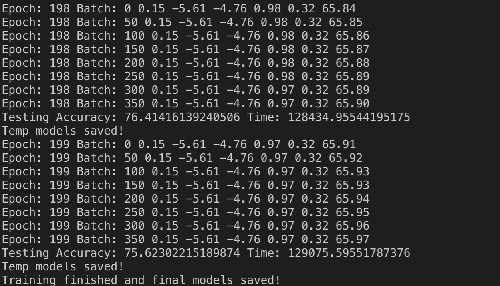
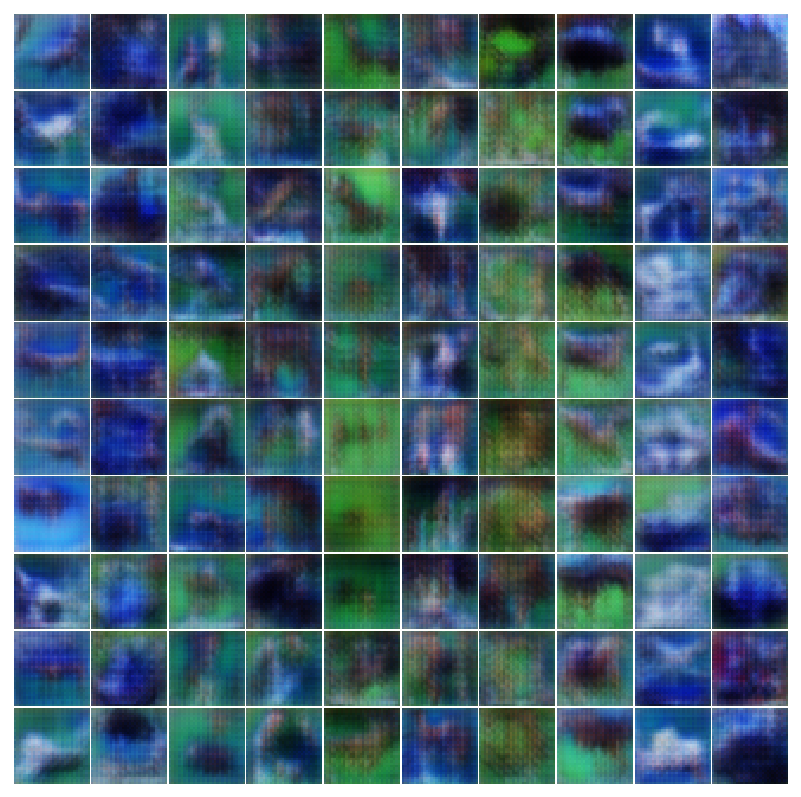
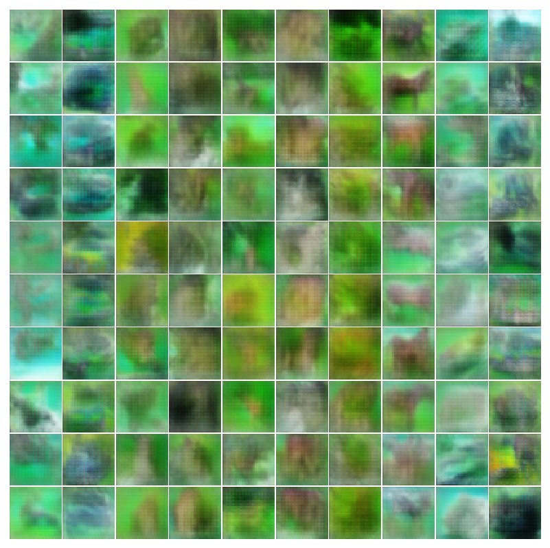
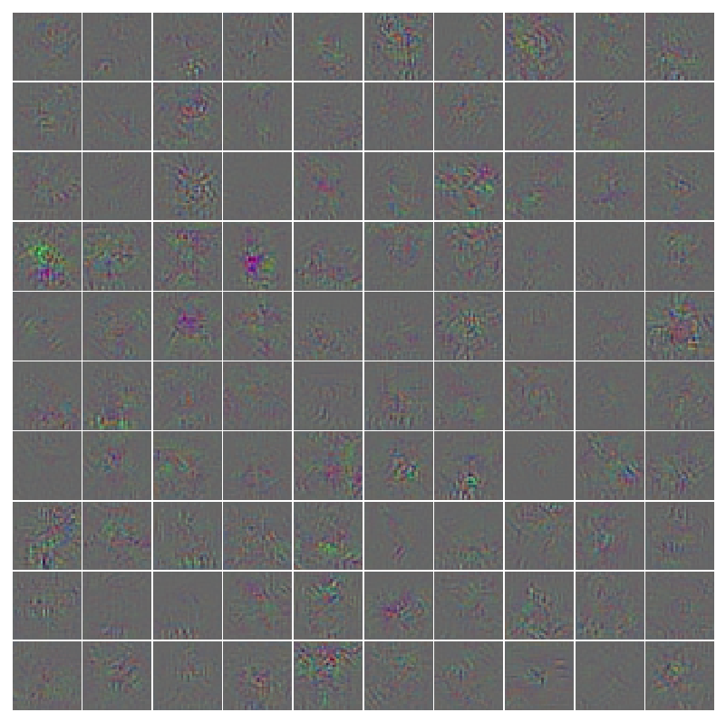
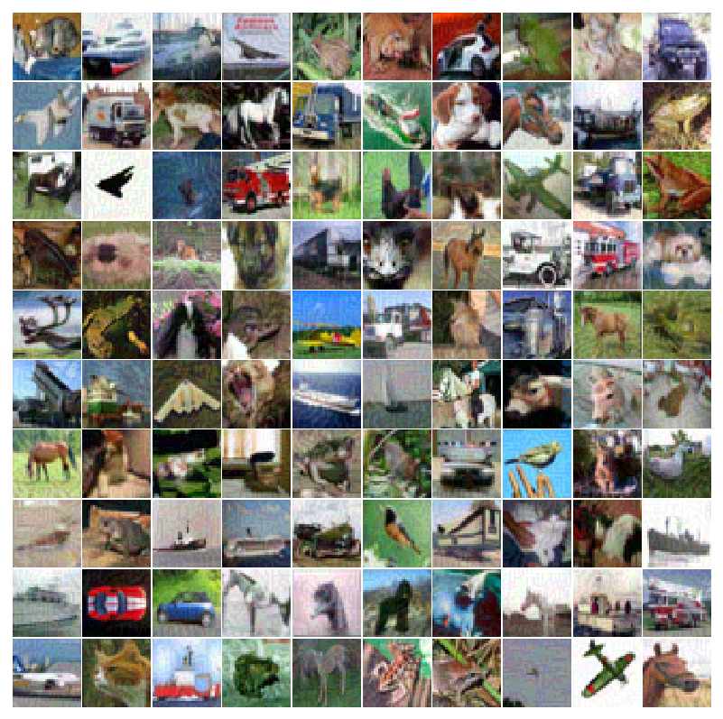
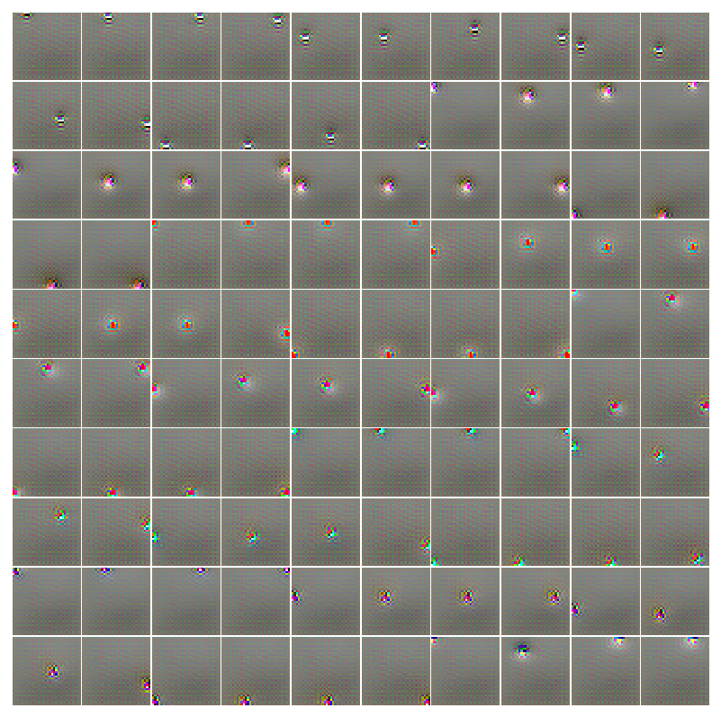
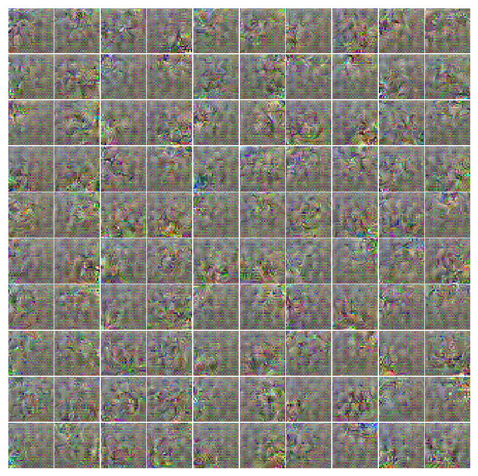
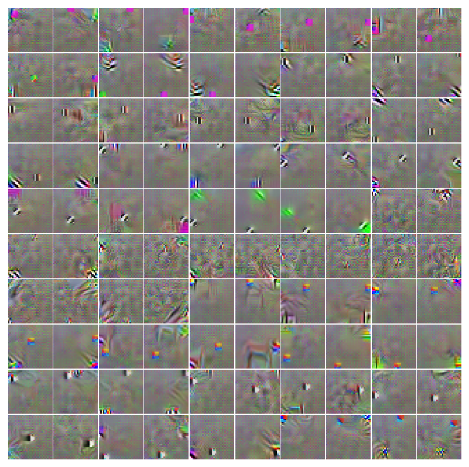

# CS 398 Deep Learning @ UIUC

## Homework 6 Understanding CNNs and Generative Adversarial Networks

Name: Yawen Duan		UIN: 655877290

### **HW6 Description:**

The assignment consists of training a Generative Adversarial Network on the CIFAR10 dataset as well as a few visualization tasks for better understanding how a CNN works.

- Train a baseline model for CIFAR10 classification (~2 hours training time)
- Train a discriminator/generator pair on CIFAR10 dataset utilizing techniques from [ACGAN](https://courses.engr.illinois.edu/ie534/fa2018/GAN.html#auxiliary-classifer-gan-acgan) and [Wasserstein GANs](https://courses.engr.illinois.edu/ie534/fa2018/GAN.html#wasserstein-gans) (~40-45 hours training time)
- Use techniques to create synthetic images maximizing class output scores or particular features as a visualization technique to understand how a CNN is working (<1 minute)

### Test Accuracy for discriminators

#### Trained without the Generator

Test Accuracy: **89.29%** after 100 epochs.

#### Trained with the Generator

Test Accuracy: **75.62%** after 200 epochs.

### Output

#### Generator

- I trained the discriminator/generator pair for 200 epochs. Below are some samples of generated images.

**Epoch 0**

**Epoch 40**

**Epoch 80**

**Epoch 120**

**Epoch 160**

**Epoch 200**

#### **Perturb Real Images**

- From **Perturb Real Images**. A batch of real images, a batch of the gradients from an alternate class for these images, and the modified images the discriminator incorrectly classifies.

Below are the images and processed images we retrieved. We found that the classification accuracy on real images is **92.97%**, but that on jittered images is **10.94%**.

**Real images**

**Gradients**

**Jittered images**

#### Synthetic Images Maximizing Classification Output

- From **Synthetic Images Maximizing Classification Output**. Synthetic images maximizing the class output. One for the discriminator trained without the generator and one for the discriminator trained with the generator.

**Synthetic images maximizing class output for discriminator trained without the generator:**

**Synthetic images maximizing class output for discriminator trained with the generator:**

#### Synthetic Features Maximizing Features at Various Layers

- From **Synthetic Features Maximizing Features at Various Layers**. Synthetic images maximizing a particular layer of features. Below are the layer 2,4,6,8 features for discriminator trained with and without the generator.

**Layer 2 features for discriminator trained without the generator**:

**Layer 4 features for discriminator trained without the generator**:

**Layer 6 features for discriminator trained without the generator**:

**Layer 8 features for discriminator trained without the generator**:

**Layer 2 features for discriminator trained with the generator:**

**Layer 4 features for discriminator trained with the generator**:

**Layer 6 features for discriminator trained with the generator:**

**Layer 8 features for discriminator trained with the generator**:

